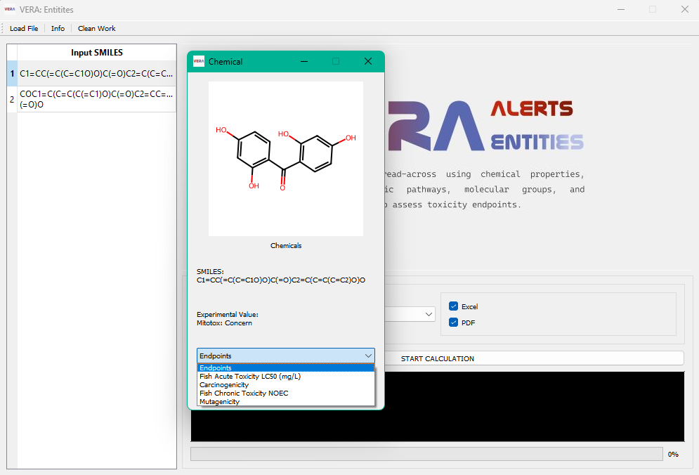
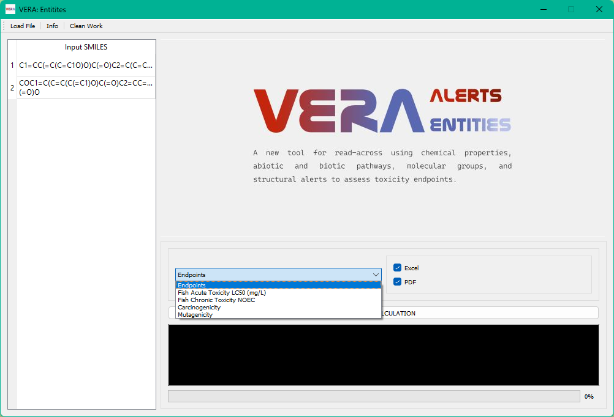

# VERA Entities

This version of VERA allows to performe a read-across analysis in two different ways:
1. VERA Alerts, as described in the papers [1](https://doi.org/10.1016/j.chemosphere.2024.142232),[2](https://doi.org/10.3390/molecules27196605). VERA Alerts assess similarity between chemicals using structural alerts specific to the property, pre-defined molecular groups and structural similarity.
2. VERA Entities. Starting with an unsupervised analysis, VERA Entities analysed several chemical, biotic and abiotic properties independently from the endpoint and used these *entities* to provide the assessment.

<!-- Questo è un commento visibile solo nel sorgente -->

## Preliminary check

**Note:** VERA works only on **Windows** environments.

### Verify your Java version

Open the **Command Prompt** (on Windows) and type:

```bash
>java -version
```

If you have a Java version greater than 11 and a Java Development Kit (JDK) version greater than 11, you’re good to go ✅

Otherwise, you need to install the latest JDK by following the instructions [here](https://www.oracle.com/java/technologies/downloads/?er=221886), selecting the correct installer for your operating system.

The JDK installation is sufficient to run VERA.
If you already have an older Java version installed, please uninstall it before using VERA.

### Antivirus Notice

If you are using AVG Antivirus, please note that it may block the application the first time you run it.
Simply allow the permission warning — after that, the application will run normally.

When you unzip and open the .exe file, make sure to grant the necessary permissions (if prompted) to allow the application to start correctly.

## How the VERA Entities and Alerts GUI work

You can download the new version of VERA [here](https://escher-2.marionegri.it/d/476ad3aa98a54d588d7a/?dl=1). The VERA GUI is a stand-alone application; it is not necessary to install the software.

1. Extract the .zip folder

2. Open the .exe file by double-clicking it. A CMD window will also open, which can be used to monitor the VERA process in detail.

3. In a few seconds, the VERA GUI will open. Click on the _Load File_ button in the top left corner of the application to upload an .xlsx file containing the SMILES of the molecule you want to assess with VERA. The SMILES list should be placed in the first column of the .xlsx file, and the column header should be "SMILES". If you have other identifiers, you can use the [Chemical Resolver application](https://github.com/EdoardoVigano/Chemical-Resolver) to search for SMILES.

<!-- By double-clicking on a SMILES entry, the structure will be displayed, allowing you to analyze one molecule at a time.

<p align="center">
  
</p>  -->

4. Then, you can select the endpoint to be evaluated and the type of output: an Excel file containing all predictions and/or an HTML report for each molecule with detailed information on how VERA performs the assessment. Please do not remove the HTML file from the folder, as this will cause parts of the output to be missing.

<p align="center">
  
</p>

5. By clicking on _START CALCULATION_, the GUI will prompt you to choose a folder to save the output files. It will automatically create a _results_ folder within the selected directory to store all reports. If an output folder already exists, VERA will automatically date the output folders.
6. Then, the read-across process will start. In the Log window, you can check the current step of the algorithm, and the progress bar will indicate the percentage of molecules processed. At the end of the calculation, a window will confirm that VERA has completed the assessment of all provided substances and that the results are available in the selected folder.
7. Before processing other chemicals, click on _Clean Work_.

## Contacts

Edoardo Luca Viganò - Laboratory of Environmental Chemistry and Toxicology - Department of Environmental Health Sciences - Istituto di Ricerche Farmacologiche Mario Negri IRCCS - Via Mario Negri 2, 20156 Milano, Italy - e-mail: edoardo.vigano@marionegri.it

Erika Colombo - Laboratory of Environmental Chemistry and Toxicology - Department of Environmental Health Sciences - Istituto di Ricerche Farmacologiche Mario Negri IRCCS - Via Mario Negri 2, 20156 Milano, Italy -e-mail: erika.colombo@marionegri.it
